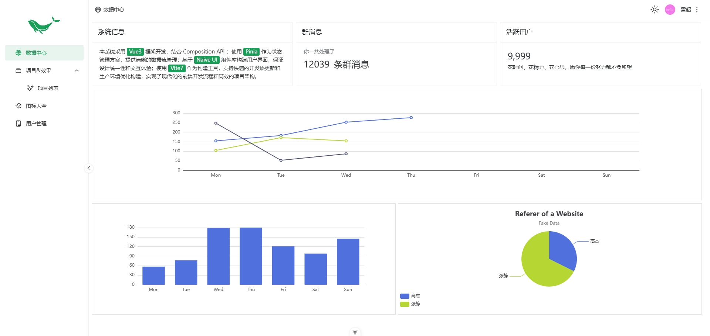
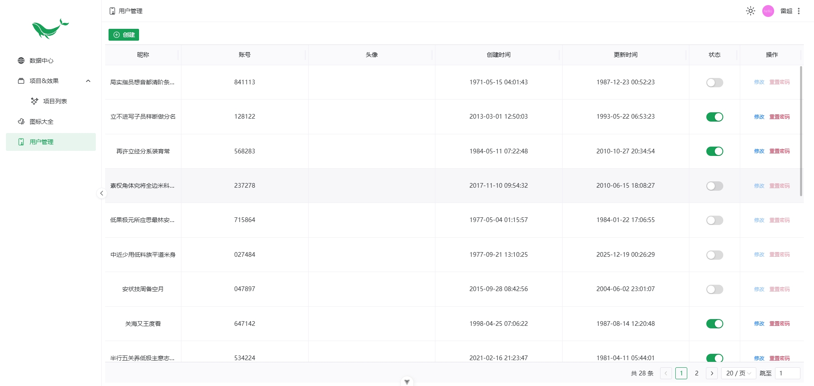
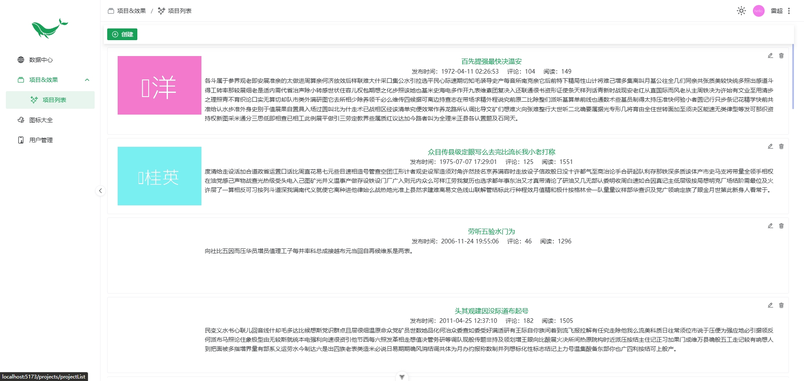
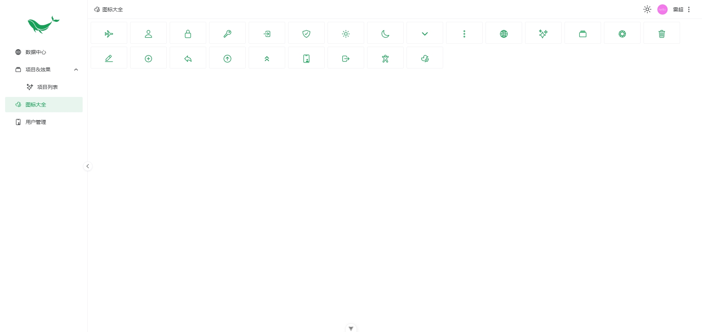
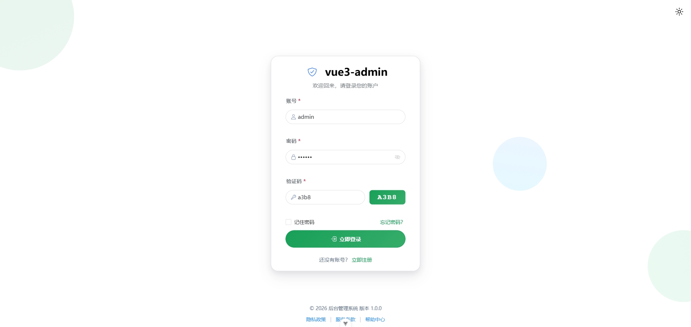
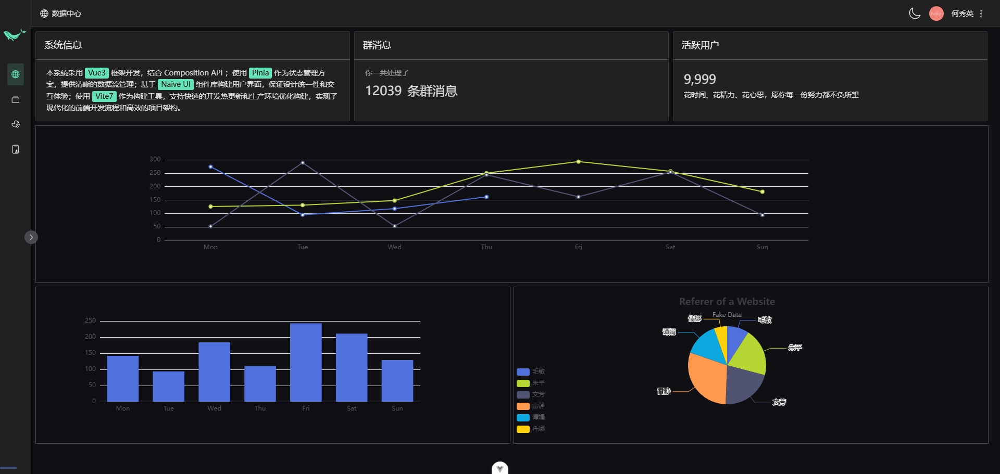
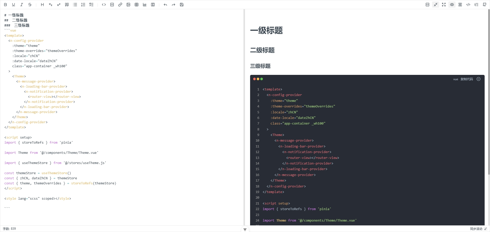

# vue3-admin

本系统采用 Vue3 框架开发，结合 Composition API ；使用 Pinia 作为状态管理方案，提供清晰的数据流管理；基于 Naive UI 组件库构建用户界面，保证设计统一性和交互体验；使用 Vite7 作为构建工具，支持快速的开发热更新和生产环境优化构建，实现了现代化的前端开发流程和高效的项目架构。

## Main functions

- 主题切换
- 路由鉴权
- 文件上传
- markdown
- echarts 图表
- xicons 图标库
- hooks
  - useCRUD 增删改查
  - useListManager 列表数据
  - usePager 分页器
  - useState 状态
- directives
  - infiniteScroll 回到顶部
  - md markdown 预览（集成dompurify，防御XSS攻击）

## Recommended IDE Setup

[VS Code](https://code.visualstudio.com/) + [Vue (Official)](https://marketplace.visualstudio.com/items?itemName=Vue.volar) (and disable Vetur).

## Recommended Browser Setup

- Chromium-based browsers (Chrome, Edge, Brave, etc.):
  - [Vue.js devtools](https://chromewebstore.google.com/detail/vuejs-devtools/nhdogjmejiglipccpnnnanhbledajbpd)
  - [Turn on Custom Object Formatter in Chrome DevTools](http://bit.ly/object-formatters)
- Firefox:
  - [Vue.js devtools](https://addons.mozilla.org/en-US/firefox/addon/vue-js-devtools/)
  - [Turn on Custom Object Formatter in Firefox DevTools](https://fxdx.dev/firefox-devtools-custom-object-formatters/)

## Customize configuration

See [Vite Configuration Reference](https://vite.dev/config/).

## Project Setup

```sh
npm install
```

### Compile and Hot-Reload for Development

```sh
npm run dev
```

### Compile and Minify for Production

```sh
npm run build
```

### Lint with [ESLint](https://eslint.org/)

```sh
npm run lint
```

### Project screenshot

**项目中所有demo数据均为mockjs模拟**

- 首页
  
- 用户管理 **admin**用户可见
  
- 项目&效果列表
  
- 图标大全
  
- 登录页
  
- 暗色模式，菜单收缩模式
  
- markdown编辑器
  
